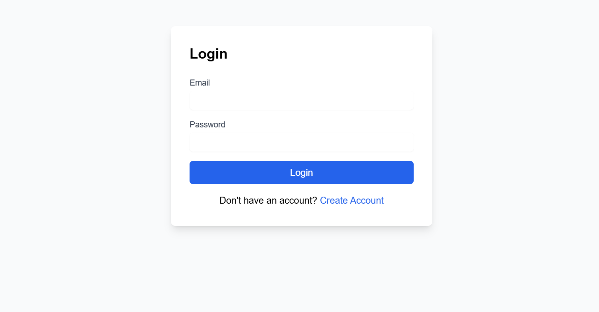

# Node-NextJS-Login-App

A Node.js and Next.js application for secure user registration and login with Two Factor Authentication (2FA).

Check out the live demo of the application [here](https://node-next-js-login-app.vercel.app/login).



**Note:** Since this demo is using a free deployment server, it might take longer sometimes to respond if the server has been inactive for long periods.


## Table of Contents

- [Introduction](#introduction)
- [Features](#features)
- [Prerequisites](#prerequisites)
- [Setup](#setup)
- [Backend](#backend)
  - [Environment Variables](#environment-variables)
  - [Running the Backend](#running-the-backend)
  - [API Endpoints](#api-endpoints)
- [Frontend](#frontend)
  - [Environment Variables](#environment-variables-1)
  - [Running the Frontend](#running-the-frontend)
- [Deployment](#deployment)
- [License](#license)
- [Live Demo](#live-demo)

## Introduction

This project is a full-stack application that provides secure user registration and login functionality with Two Factor Authentication (2FA) using OTP (One Time Password) sent via email.

## Features

- User registration with validation
- User login with password hashing
- OTP generation and email sending for 2FA
- JWT-based authentication
- User profile management
- Account deletion

## Prerequisites

- Node.js (v14 or higher)
- MongoDB
- Redis
- Gmail account for sending emails

## Setup

### Backend

1. Clone the repository:

    ```sh
    git clone https://github.com/YogeshK05/Node-NextJS-Login-App.git
    cd Node-NextJS-Login-App/backend
    ```

2. Install dependencies:

    ```sh
    npm install
    ```

3. Create a `.env` file in the [backend](http://_vscodecontentref_/1) directory and add the following environment variables:

    ```env
    PORT=5000
    MONGO_URI=<your_mongodb_uri>
    JWT_SECRET=<your_jwt_secret>
    EMAIL_USER=<your_gmail_email>
    EMAIL_PASS=<your_gmail_password>
    REDIS_HOST=<your_redis_host>
    REDIS_PORT=<your_redis_port>
    ```

### Running the Backend

1. Start the backend server:

    ```sh
    npm run dev
    ```

2. The backend server will be running at `http://localhost:5000`.

### API Endpoints

- **POST /api/register**: Register a new user
- **POST /api/login**: Login a user and generate OTP
- **POST /api/verify-otp**: Verify OTP and generate JWT token
- **GET /api/user/:email**: Get user details
- **DELETE /api/delete-user/:email**: Delete user account

### Frontend

1. Navigate to the [frontend](http://_vscodecontentref_/2) directory:

    ```sh
    cd ../frontend
    ```

2. Install dependencies:

    ```sh
    npm install
    ```

3. Create a `.env` file in the [frontend](http://_vscodecontentref_/3) directory and add the following environment variables:

    ```env
    NEXT_PUBLIC_API_URL=http://localhost:5000/api
    ```

### Running the Frontend

1. Start the frontend server:

    ```sh
    npm run dev
    ```

2. The frontend server will be running at `http://localhost:3000`.

## Deployment

### Backend

1. Build the backend for production:

    ```sh
    npm run build
    ```

2. Start the backend server:

    ```sh
    npm start
    ```

### Frontend

1. Build the frontend for production:

    ```sh
    npm run build
    ```

2. Start the frontend server:

    ```sh
    npm start
    ```

## License

This project is licensed under the MIT License.

## Live Demo

Check out the live demo of the application [here](https://node-next-js-login-app.vercel.app/login).